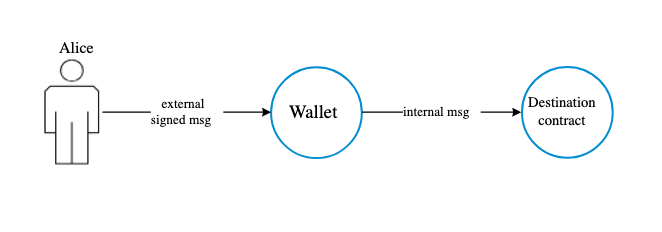

# FunC 笔记

## 一、消息模式

### 1.1 external msg 外部消息

外部消息由用户签名发送到钱包合约。

### 1.2 internal msg 合约内部消息

内部消息不需要签名，是合约之间互相发消息，根据合约代码验证和处理消息。

## Cell && Slice 切片

在 FunC 编程语言中，切片（slice）是一种特殊的数据结构，用于解析和处理细胞（cell）中的数据。
切片可以看作是指向细胞中数据的一种视图，允许对数据进行读取和解析。尽管它类似于对象，但在概念和用途上有其特定的功能和限制。

什么是 Cell？

在 FunC 和 TVM（TON Virtual Machine）中，cell 是一种基础的数据结构，用于存储合约状态和消息。一个 cell 可以包含原始数据、引用其他 cell，以及其他复杂的数据结构。cell 是一种高度灵活和紧凑的序列化格式，非常适合于区块链的高效存储和传输。

什么是 Slice？

切片（slice）是从 cell 中提取的一段数据视图，用于解析和读取 cell 中存储的数据。它包含了数据的位置和长度信息，可以逐步解析 cell 中的数据而不需要一次性加载整个 cell 的内容。切片提供了一组方法来方便地读取和处理这些数据，例如读取整数、引用等。

切片的特点

	1.	视图而非拷贝：切片是对 cell 中数据的视图，而不是数据的拷贝。因此，操作切片不会复制数据，只会读取和解析现有的数据。
	2.	有限长度：切片具有有限的长度，只能访问其范围内的数据。这可以防止超出范围的访问，提高安全性。
	3.	解析方法：切片提供了一组方法，用于从中读取不同类型的数据。例如，load_uint 方法用于读取无符号整数，load_ref 方法用于读取引用。

